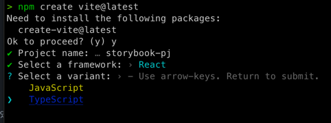
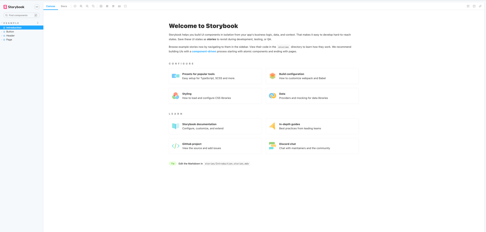
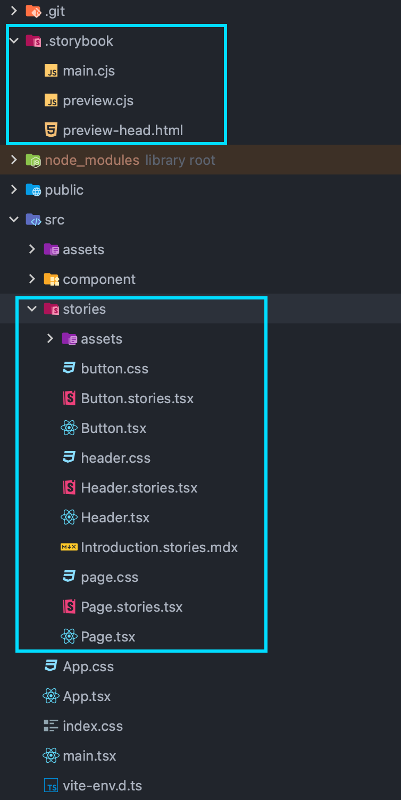
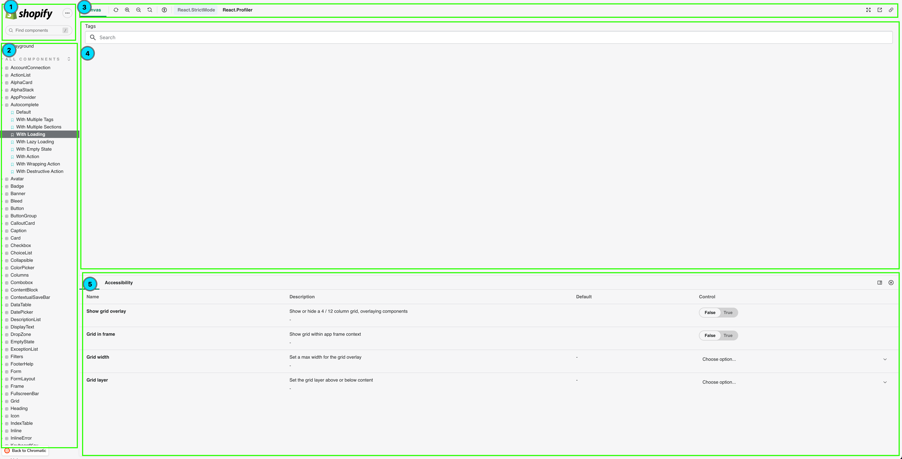

## Storybook 이란

프로젝트 진행하면서 개발한 UI를 별도로 구성하여 관리하는 오픈소스 도구 입니다.
파워풀한 에드온 기능들도 많이 제공하고 있습니다. 또 디자인 시스템 처럼 내가 사용하는 프로젝트에서
사용하는 컴포넌트 및 페이지를 스토리북으로 관리하며, 테스트까지 넣을 수 있습니다.

개발 서버를 기동하지 않고, 바로 스토리북 서버를 실행하여 바로바로 원하는 컴포넌트나 페이지에 접근해서
바로바로 확인할 수 있다는 것도 큰 장점이 되는것 같습니다.

특정 화면을 보기 위해서 로그인하고 -> 인증하고 -> 메뉴이동 -> 페이지까지 가는 절차가 확 줄어들고,
해당 페이지별로 테스트를 실행할 수 있기 때문에 새로운 기능추가 및 변경 요건에도 빠르고 안전하게 대응이 가능합니다.

또 Storybook이랑 chromatic이랑 연동하여 픽셀 시각화 테스트까지 넣으면 한층 더 높은 시너지가
발생합니다. chromatic는 무료, 유료 버전이 있지만, 프로젝트가 작다면 무료버전으로도 충분히 사용가능하고,
좋은 효율을 보고 있다면 결제해서 사용해도 좋을듯 합니다. 또 이슈 사항 메일을 보내면 진짜 빠르게
답변이 오는것도 큰 장점인것 같습니다. 크로메틱 관련하여는 다른 포스트에 더 정리해서 공유 하겠습니다.

<b>특징<b>
- 프로젝트에서 사용하는 컴포넌트 관리
- 사내 개발자,디자이너,기획자 협업 소통창구 및 컴포넌트 문서화
- 컴포넌트 or 화면 or 등등 각각 개별적으로 실행할 수 있으며, 시각적 & 인터렉션 테스트를 실행할수 있습니다.

## 스토리북 설치하기

환경 구성은 `React-vite`, `storybook-vite` 사용 했습니다.

>스토리북에 7.0버전 부터는 vite를 적극적으로 사용한다고 한다. (성능 향상)


### React-vite 설치하기
```npm
npm create vite@latest
```
해당 명령어를 입력하면, `Project Name` , `framework`, `variant`, 선택을 하면 설치가 됩니다.



```npm
npm run dev  
```
명령어를 실행하면 리액트 서버가 띄는걸 확인 할수 있습니다.


### storybook-vite 설치하기
```npm
npx sb init --builder @storybook/builder-vite
```
명령어만 입력하면 자동으로 설치가 끝난다.🎃
```npm
npm run storybook
```
명령어로 스토리북 서버를 띄워보자


위 이미지처럼 스토리북 로컬 사이트가 나오면 정상적으로 설치가 되었습니다.👏

## 스토리북 폴더 구조


스토리북을 설치가 끝나면 root 경로에 `.storybook` 폴더가 존재 하는데, 스토리북 환경 설정,
최소 실행되는 app에 대한 정보들이 있습니다.
- main.cjs
  - 스토리북 환경설정 및 옵션 파일 ( webpack, vite 설정도 여기에 추가한다.)
- preview.cjs
  - 스토리북 글로벌 파라미터 값을 설정하는 파일
- preview-head.html
  - 스토리북 웹서버가 실행되는 html

src 폴더 아래 `stories`는 스토리북에 들어가는 `*.stories.tsx`파일이 모여 있는 폴더 입니다.
`stories`같은 경우는 내가 어떻게 프로젝트 구성하는지에 따라서 유연하게 변경 가능합니다.
위에 main.cjs 파일을 열어보면 
```js
 "stories": [
    "../src/**/*.stories.mdx",
    "../src/**/*.stories.@(js|jsx|ts|tsx)"
  ],
```
stories를 읽어오는 경로가 있습니다.. 해당 설정을 통해서 `*.stories.tsx` 파일을 찾아서 실제 빌드해서
서버를 띄우게 됩니다.

## 스토리북 페이지 구조
> react components가 구성된 오픈소스 스토리북 사이트가 있는 링크(https://storybook.js.org/showcase/tag/react)
> 다른사람들은 어떻게 구성 하고 있는지 참고할 수 있다.
### shopify 오픈소스를 기준으로 설명 합니다.


1. 스토리북 Logo, 단축키, find 기능이 있는 영역입니다.
2. 프로젝트에서 구성하고 있는 스토리(컴포넌트,페이지,컴포지션 등등..)있는 tree Menu 입니다.
3. 스토리북에서 제공되는 기능 옵션들이 있는 영역입니다.
   4. 커스텀이 가능해서 테마, 해상도 (모바일,테스크탑, 등등) 확대, margin,padding,link 다양한 옵션들이 있습니다.
   5. docs 기능이 있어 컴포넌트를 문서화할 수 있습니다.
5. canvas 영역 내가 실제로 구현한 컴포넌트,페이지가 렌더링 되는 영역입니다.
6. canvas 영역을 컨트롤할 수 있는 영역
   7. controls 속성을 넣어서 canvas에 렌더링 된 화면을 컨트롤 및 제어가 가능합니다.
   7. interactions 테스트도 넣을 수 있습니다.
   8. actions을 넣어서 canvas에서 실행되는 이벤트 로그도 남겨서 볼 수 있습니다.


다음 챕터에서는 스토리북 커스텀 설정 및 옵션 설정에 대하여 포스트를 작성 하겠습니다.


### 참조
- https://storybook.js.org/blog/storybook-for-vite/
