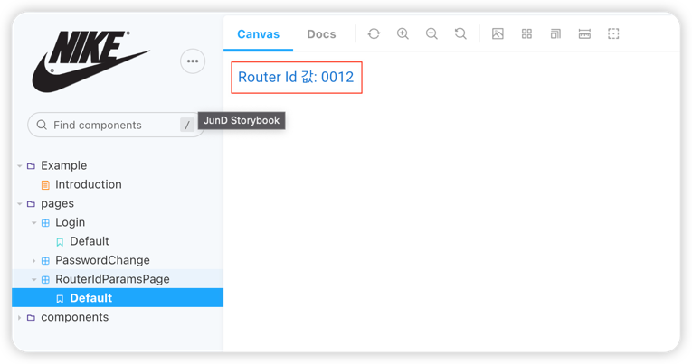

## Storybook React Router 연결하기

스토리북으로 컴포넌트을 관리 하다가 지금은 개발된 Page도 스토리북에 추가하여 interaction 테스트 기능을
넣는 작업을 진행 했습니다. 그러다보니 React-router를 이용한 페이지 이동에 넘어오는 Params 값을 사용해하는
케이스들이 발생했습니다. storybook에 React-router를 연동하는 작업을 진행 했습니다.


## Storybook 설정

path: .storybook > preview.js 파일에 `decorators` 에 설정한 StorybookApp 파일을 수정 합니다.
```typescript
export const decorators = [StorybookApp];
```


StorybookApp.tsx
```javascript

export const StorybookApp = (StoryComp: Story) => {
  return (
    <div style={{ width: '100%', height: '100%' }}>
      <CssBaseline />
      <QueryClientProvider client={queryClient}>
        <ReactQueryDevtools initialIsOpen={false} />
        <StoryComp />
      </QueryClientProvider>
    </div>
  );
};
```
기존에 셋팅한 StorybookApp.tsx를  아래와 같이 변경 합니다.

```javascript
export const StorybookApp2 = (StoryComp: Story, { parameters: { paramLink } }: StoryContext) => {
  return (
    <div style={{ width: '100%', height: '100%' }}>
      <CssBaseline />
      <QueryClientProvider client={queryClient}>
        <ReactQueryDevtools initialIsOpen={false} />
        {!paramLink ? (
          <MemoryRouter>
            <StoryComp />
          </MemoryRouter>
        ) : (
          <MemoryRouter initialEntries={[paramLink.route]}>
            <Routes>
              <Route path={paramLink.path} element={<StoryComp />}></Route>
            </Routes>
          </MemoryRouter>
        )}
      </QueryClientProvider>
    </div>
  );
};

```
위 코드를 보면 Props로 stories에서 설정하는 parameters 값을 전달 받습니다.
> [MemoryRouter](https://reactrouter.com/en/main/router-components/memory-router) 관련 내용입니다.


라우터에서 셋팅한 값을 `paramLink`통해서 전달 받고, MemoryRouter에 Route 셋팅을 합니다.
라우터 파라미터를 사용하는 stories 에서는 props를 받아서 `initialEntries`, `path`를 셋팅하고,
`paramLink`가 없는 경우는 셋팅하지 않게 됩니다.


## React Router URL ID값 확인하기
stories 파일을 작성 합니다.
```javascript
const Template: ComponentStory<typeof RouterIdParamsPage> = () => {
  return <RouterIdParamsPage />;
};

export default {
  title: 'pages/RouterIdParamsPage',
  component: RouterIdParamsPage,
  argTypes: {},
  parameters: {
    paramLink: {
      path: '/test/page/:id',
      route: '/test/page/0012',
    },
  },
} as ComponentMeta<typeof RouterIdParamsPage>;
export const Default = Template.bind({});
Default.args = {};

```
위 코드에서 export default `parameters`를 보게 되면, `paramLink` 객체에 `path`, `rute`가
셋팅되며, path에 path key(id)를 셋팅하고, 해당 id 값을 route에 0012을 셋팅 합니다.

`RouterIdParamsPage` 페이지 컴포넌트에서 console.log를 출력을 해봅니다.

```javascript
function RouterIdParamsPage() {
  const { id: stringId } = useParams();
  return (
    <Typography variant={'body1'} color={'primary'}>
      Router path id 값: {stringId}
    </Typography>
  );
}

export default RouterIdParamsPage;

```
`useParams` 훅을 통해서 path id 값을 가져와서 화면에 출력 합니다.



stories 파일이 많아지는 경우 관리하기가 힘들어 지기 때문에 따로 `parameters`를 관리하는 설정 파일을
추가 합니다.

StorybookParamLink.ts 파일을 하나 만들고
```javascript
export const StorybookParamLink = {
    permissionDetail: {
        path: '/permission/:id',
        route: '/permission/1',
    },
    permissionUpdate: {
        path: '/permission/:id/update',
        route: '/permission/1/update',
    },
    roleDetail: {
        path: '/role/:id',
        route: '/role/1',
    },
    userDetail: {
        path: '/user/:id',
        route: '/user/1',
    },
}
```

paramsLink가 필요한 `stories`에 import 사용해서 관리를 합니다.

```javascript
const Template: Story = () => {
  return <Permission />
}
export default {
  title: 'pages/Permission/PermissionUpdate',
  component: PermissionCreateUpdate,
  argTypes: {},
  decorators: [withLinks],
  parameters: {
    paramLink: StorybookParamLink.permissionUpdate,
  },
} as Meta

```

페이지 별로 router path id를 받아서 case 별로 스토리북 안에서 테스트를 할 수 있습니다.


### 참조

- https://reactrouter.com/en/main/router-components/memory-router
