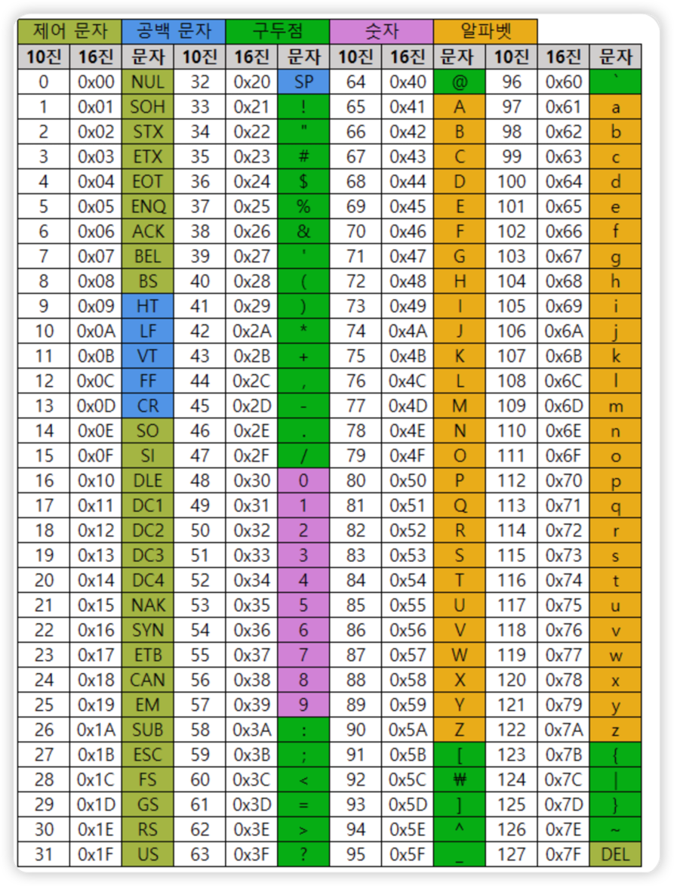

> 특정 조건에 따른 정규표현식으로 처리하는 방법에 대한 내용입니다. 정규표현식에 문법에 대한 내용은 아니에요 😅
>

## 개요

화면에서 사용자로 부터 입력 받는 데이터를 처리해야 하는 경우가 많이 있다. 회원가입,문의하기,리뷰남기기 등등 여기에서 입력에 대한 부분을 제어하는 로직이 필요하다. XSS 스크립트 공격, DataBase에서 정의한 데이터 타입에 대하여 고민을 해야한다. 이모지를 입력, 특정 특수문자 입력, 불필요한 유니코드 등등 n개의 입력 데이터를 모두 체크하는건 불가능하다. 그럼 반대로 입력가능한 문자만 입력 받도록 한다면? 좀 더 쉽게 문제를 해결 할 수 있다.

## 정규표현식

Javascript에서는 정규표현식을 통하여, 특정 패턴, 입력된 문자 체크, 등 많은 활용할 수 있으며, 정규표현식은 내부적으로 정규표현식 엔진을 사용하여 처리된다. JavaScript 엔진은 패턴 매칭을 위해 `NFA`(Non-deterministic Finite Automaton) 또는 `DFA`(Deterministic Finite Automaton)를 사용한다. 패턴을 작성을 한다면 좋은 성능을 뽑아낼수 있다.

## 사용방법

```tsx
// const regex = /pattern/;
const regex = new RegExp("pattern");
const str = "This is a sample string.";

console.log(regex.test(str)); // true
console.log(regex.exec(str)); // ["pattern", index: 8, input: "This is a sample string."]
console.log(str.match(regex)); // ["pattern"]
console.log(str.replace(regex, "replacement")); // "This is a sample string."
console.log(str.search(regex)); // 8
console.log(str.split(regex)); // ["This is a sample string."]
```

## 정규표현식 정의

**조건**

- 영어, 숫자 ,한글, ASCII 정의된 특수문자만 입력 가능
- 특정 유니코드 입력 불가, 이모지 입력 불가

1. 한글입력 체크 정규표현식

```tsx
const regex = /[ㄱ-ㅎ|ㅏ-ㅣ|가-힣]/;
```

위의 정규표현식은 한글 음절(가-힣), 초성(ㄱ-ㅎ), 중성(ㅏ-ㅣ)에 대한 패턴

1. 영문 입력 체크 정규표현식

```tsx
const regex = /[a-zA-Z]/;
```

위의 정규표현식은 영문 대문자(A-Z)와 영문 소문자(a-z)에 대한 패턴

1. 특수문자 입력 체크 정규표현식

```tsx
const regex = /[!@#$%^&*(),.?":{}|<>]/;
```

위의 정규표현식은 일부 특수문자들을 포함한 패턴

1. 한글,영문,특수문자 입력 체크 정규표현식

```tsx
const regex = /[ㄱ-ㅎ|ㅏ-ㅣ|가-힣|a-zA-Z|!@#$%^&*(),.?":{}|<>]/;
```

## 정규표현식 개선

- ASCII 코드 범위로 체크하기

예를 들어, 영문 대문자(A-Z), 영문 소문자(a-z), 그리고 특수문자 중에서 아스키코드 범위로 체크하고자 한다면 다음과 같이 정규표현식을 작성할 수 있다.

```tsx
const regex = /[\x41-\x5A \x61-\x7A]/; // 16진 표현

const str = "Hello, @123!";

console.log(regex.test(str)); // true
```



위 아스키 코드표를 보게 되면 특수문자부터 ~ 숫자 ~ 영문까지 순서대로 나열되어 있는 걸 볼 수 있다.

<aside>
💡  정규 표현식에서 `-` 는 범위를 나타내는 메타문자로 사용 된다.

</aside>

정규식 `[ -~]`은 ASCII 문자 범위를 나타내는 정규식이고,위 표를 보면 `~`는 ASCII 문자에서 가장 마지막에 위치한 문자이다. 공백(`' '`)은 표에 SP를 말한다.

즉, **`[ -~]`는 ASCII 문자에서 공백(`' '`)부터 물결(`~`)까지의 범위에 속하는 문자를 의미한다. 이 범위에는 영문 대소문자, 숫자, 특수문자가 포함된다.**

```tsx
const regex = /[ -~ㄱ-ㅣ 가-힣]/;
const str = "Hello, 안녕하세요!";

console.log(regex.test(str)); // true
```

`/[^ -~ㄱ-ㅣ가-힣\t\n\r]+/g` 해당 정규표현식 패턴으로 영문(대소문자),한글(자음 모음 음절),숫자,특수문자

에 대한 체크가 가능하다.

<aside>
💡 `\t\n\r]+/g`

- **`[\t\r]`: 이 부분은 문자 클래스로, 탭과 캐리지 리턴(줄바꿈) 문자를 의미한다.**
- **`\t`는 탭 문자를, `\r`은 캐리지 리턴 문자를 나타낸다.**
- **`+`: 이 부분은 바로 앞의 패턴이 한 번 이상 반복될 수 있음을 나타낸다.**
- **`/g`: 이 부분은 정규표현식의 플래그로, 전역 검색을 수행 한다.**
</aside>

Emoji, 특정 유니코드 문자를 입력하면 위 표현식을 통과 하지 못하고 체크를 할 수 있게 된다.

Input에 onChange이벤트에서 문자를 체크하고 허용하지 않은 문자가 입력이 되는 경우 제어가 가능하다.

## 이슈 발생

위 정규표현식으로 입력에 대하여 체크를 하고 있었는데, 모바일 사용자 경우 천지인 키보드를 사용하거나 아이폰에서 **`ᆞ`**문자를 입력을 하는경우 정규표현식에서 입력을 막아버려서 정상적인 입력을 할 수 없었다. 이후 키보드에 대한 유니코드를 검색하며 유니코드 문자도 추가해 주었다.

>
>
> 1. **U+318D: ㆍ (IDEOGRAPHIC FULL STOP) - 이 문자는 한국어에서 사용되는 구분 기호로, 한글 문장에서 문장 부호로 사용됩니다.**
> 2. **U+119E: ᆞ (HANGUL JONGSEONG KIYEOK-PAN-SIOS) - 이 문자는 한글 자모의 종성 중 하나로, 자음 'ㄱ'의 여섯 번째 형태입니다.**
> 3. **U+11A2: ᆢ (HANGUL JONGSEONG HIEUH-NIEUN) - 이 문자는 한글 자모의 종성 중 하나로, 자음 'ㅎ'의 여섯 번째 형태입니다.**
> 4. **U+2022: • (BULLET) - 이 문자는 점 형태의 기호로, 목록 항목을 나타내거나 강조하는 데 사용됩니다.**
> 5. **U+2025: ‥ (TWO DOT LEADER) - 이 문자는 두 개의 점으로 이루어진 기호로, 범위를 나타내거나 생략된 부분을 표시하는 데 사용됩니다.**
> 6. **U+00B7: · (MIDDLE DOT) - 이 문자는 가운데 위치한 점으로, 다양한 용도로 사용될 수 있습니다.**
> 7. **U+FE55: ﹕ (SMALL COLON) - 이 문자는 작은 크기의 콜론으로, 특정 어휘적인 용도로 사용될 수 있습니다.**

```tsx
const regExp = /[^ -~ㄱ-ㅣ가-힣\t\n\r\u318D\u119E\u11A2\u2022\u2025\u00B7\uFE55]+/g;
```

## 맺으며

사용자 입력에 대한 제어를 개발하면서 많은 시행착오가 있었고, 아스키코드 범위로 체크를 할 수 있다라는 점을 알게 되었다. 특정 디바이스에서 사용하는 유니코드 같은 경우 내가 바로바로 알 수 없기 때문에 나중에 또 문제가 발생할것 같다. 이 부분에 대해서는 어떤식으로 처리해야할지 고민중에 있다. 🥲 

### reference

https://codepoints.net/hangul_jamo

https://d2.naver.com/helloworld/76650

[https://ko.wikipedia.org/wiki/유니코드_0000~0FFF](https://ko.wikipedia.org/wiki/%EC%9C%A0%EB%8B%88%EC%BD%94%EB%93%9C_0000~0FFF)
